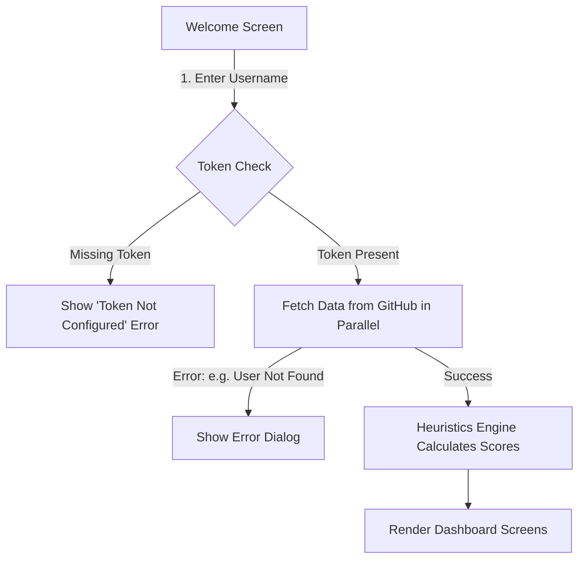

# DevPulse AI — Project Guide

Welcome to the **DevPulse AI** project! This guide is designed to explain how this application works under the hood, using simple analogies and clear language that anyone can understand—whether you are a seasoned software engineer or someone brand new to coding.

---

## 🌟 What is DevPulse AI?

Think of DevPulse AI like a **"Fitbit for Software Developers."** 
Just like a fitness tracker gathers raw heart rate and step counts to tell you how healthy you are, DevPulse AI gathers your raw code activity on GitHub (like what programming languages you use, how many stars your projects have, and how active you are) and converts it into a clean, visual report. 

It tells you:
1. **Your Developer Persona:** Are you a database specialist (Backend), a website creator (Frontend), a cloud manager (DevOps), or an AI scientist?
2. **Your Skill Ratings:** Beautifully animated scores from 0 to 98 for different areas of programming.
3. **Your Personalized Roadmap:** Step-by-step career suggestions showing you what technologies you should study next based on your current GitHub profile.

---

## 🔄 How the App Works (The Step-by-Step Flow)

Here is exactly what happens when you open the app and use it:



### 1. The Welcome Door (Login Screen)
When you open the app, you see a login screen inspired by premium tech designs. You enter your GitHub username (for example, `torvalds` or `octocat`) and tap **Analyze Profile**.

### 2. The Gatekeeper (Security Token Check)
To fetch details from GitHub, the app requires a key called a **Personal Access Token**. 
- The app looks inside a secure config file (`local.properties`) for this token.
- If the token is missing, the app displays a dialog saying `"GitHub token not configured."`
- If the token is present, it securely proceeds to the next step.

### 3. The Parallel Fetchers (Retrieving Data)
The app needs four pieces of information from GitHub:
- **User Profile:** Your name, avatar photo, bio, and locations.
- **Repositories:** A list of folders containing code you have written.
- **Followers:** Other programmers who follow your account.
- **Following:** Programmers you follow.

Instead of asking for these one after another (which takes time), the app uses Kotlin **Coroutines** to ask for all four in parallel—like calling four friends at the same time on different phones. 

### 4. The Brain (The Heuristics Engine)
Once all the files arrive, our **Analysis Engine** reads through them:
- It counts your total repositories, stars, and forks.
- It parses the text descriptions of your projects for keywords (like `Docker`, `Python`, `React`, or `SQL`).
- It calculates an **activity score** based on when you last updated your code.
- It assigns you score ratings (0-98) for various fields based on your code makeup.
- It identifies your weakest score and builds a chronological learning plan to help you grow.

### 5. The Visual Gallery (The Dashboard)
Finally, the app transitions to the **Dashboard Screen**, rendering five tabs:
- **Dashboard Tab:** Profile header, grid of core statistics (repos, followers), and a list of your top 5 projects.
- **Analytics Tab:** Custom-drawn visual charts showing your programming language distribution (a donut pie chart) and your project updates (Bezier line graphs).
- **AI Insights Tab:** Visual progress circles showing your ratings (Backend, DevOps, etc.) alongside AI-style writeups of your strengths, weaknesses, and recommended roles.
- **Roadmap Tab:** A vertical interactive timeline that maps out steps you can take to learn new skills.
- **Settings Tab:** Controls to clear caching and reload active profiles.

---

## 📁 The Folder Structure (Where is everything?)

The project is structured using the **MVVM (Model-View-ViewModel)** design pattern. This keeps visual layout files separate from data-gathering files and calculation engines.

Inside `app/src/main/java/com/devpulse/ai/`, you will find:

```text
├── DevPulseApp.kt           <-- Initializes the app
├── MainActivity.kt          <-- Host screen that runs the app container
├── ui/
│   └── theme/               <-- Visual styling, fonts, colors (Color.kt, Theme.kt)
├── navigation/
│   ├── NavGraph.kt          <-- Map of screen paths
│   └── Screen.kt            <-- List of screen names/routes
├── model/
│   ├── GitHubUser.kt        <-- Data model for user profile
│   ├── GitHubRepo.kt        <-- Data model for repository details
│   └── GitHubUserSummary.kt <-- Data model for followers
├── network/
│   └── GitHubApiService.kt  <-- Postman that configures web requests
├── repository/
│   └── GitHubRepository.kt  <-- Worker that fetches and translates network errors
├── viewmodel/
│   └── ProfileViewModel.kt  <-- Brain that stores UI states (Loading, Success, Error)
├── components/
│   ├── BrandComponents.kt   <-- Reusable UI cards and text fields
│   ├── CustomCharts.kt      <-- Visual canvas charts (donut, Bezier line, bars)
│   └── ShimmerLoaders.kt    <-- Glowing loading animation cards
├── screens/
│   ├── LoginScreen.kt       <-- Welcome/Username entry page
│   ├── DashboardScreen.kt   <-- Main Dashboard scaffolding
│   └── tabs/                <-- Individual tab views (TabDashboard, TabAnalytics, etc.)
└── utils/
    └── AnalysisEngine.kt    <-- Calculator that parses stats and creates roadmaps
```

---

## 🔑 Important Files Explained

### 1. local.properties
* **What it is:** A secure local notepad.
* **Why it matters:** It holds your private `GITHUB_TOKEN=ghp_...` key. Since it is excluded from git version tracking, it keeps your secret credentials safe from being leaked online.

### 2. app/build.gradle.kts
* **What it is:** The recipe book of the app.
* **Why it matters:** It defines what libraries the app needs to build (like Retrofit for network calls and Jetpack Compose for layouts). It also reads your `GITHUB_TOKEN` from `local.properties` and injects it into the compilation environment securely.

### 3. GitHubApiService.kt
* **What it is:** The communicator.
* **Why it matters:** It sets up the network client. It automatically adds headers to every request (like user agent details and the secure token) so GitHub recognizes and trusts the request.

### 4. GitHubRepository.kt
* **What it is:** The coordinator.
* **Why it matters:** It fetches data from GitHub in parallel. If anything goes wrong (e.g. no internet, rate limits reached, or bad credentials), it translates the dry technical HTTP numbers into meaningful exceptions (like `NetworkException` or `RateLimitException`).

### 5. ProfileViewModel.kt
* **What it is:** The state machine.
* **Why it matters:** It holds the current status of the app. It communicates to the screens whether the app is currently `Idle` (waiting), `Loading` (showing shimmers), `Success` (displaying metrics), or in `Error` (showing popups).

### 6. AnalysisEngine.kt
* **What it is:** The algorithm calculator.
* **Why it matters:** It parses dates (like translating `2011-01-26T19:01:12Z` to `Jan 26, 2011`) and reviews repository structures to calculate your scores and generate your career roadmaps.

### 7. CustomCharts.kt
* **What it is:** The artist.
* **Why it matters:** Drawing smooth Bezier curves, bar charts, and donut segments requires custom instructions. This file draws these graphics directly on screen using Jetpack Compose's `Canvas` tool, ensuring lightweight, high-performance visualizations without third-party rendering overhead.
